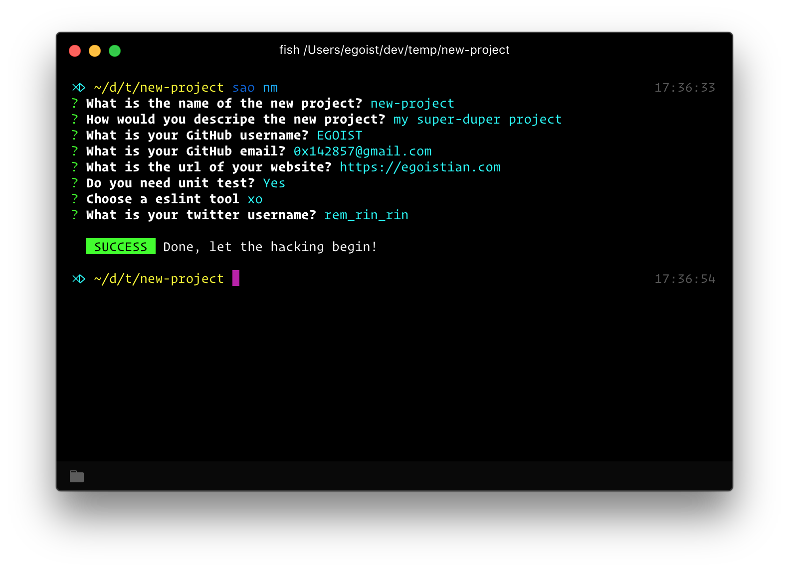

<h1 align="center">template-nm</h1>

<p align="center">
  Scaffolding out a node module.
</p>




## sao-template-nm

A copy of [template-nm](https://github.com/egoist/template-nm), but for geekplux.

## Features

- Unit test with [jest](https://facebook.github.io/jest/)
- ESLint with [xo](https://github.com/sindresorhus/xo) or [standard](https://github.com/feross/standard)
- CircleCI with [Yarn](yarnpkg.com) support
- Optionally compile ES2015 code using [bili](https://github.com/unipahq/bili)
- Optionally add coverage report

## Usage

Install [SAO](https://github.com/egoist/sao) first.

### From git

```bash
sao geekplux/sao-template-nm
```

## License

MIT &copy; GeekPlux
